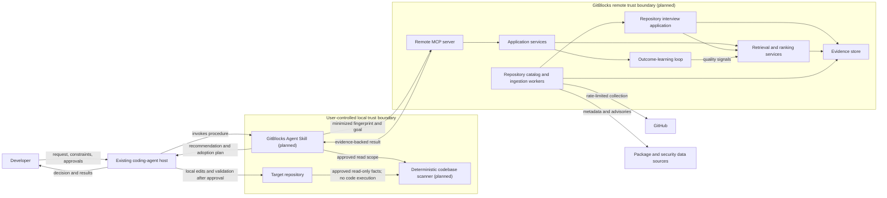
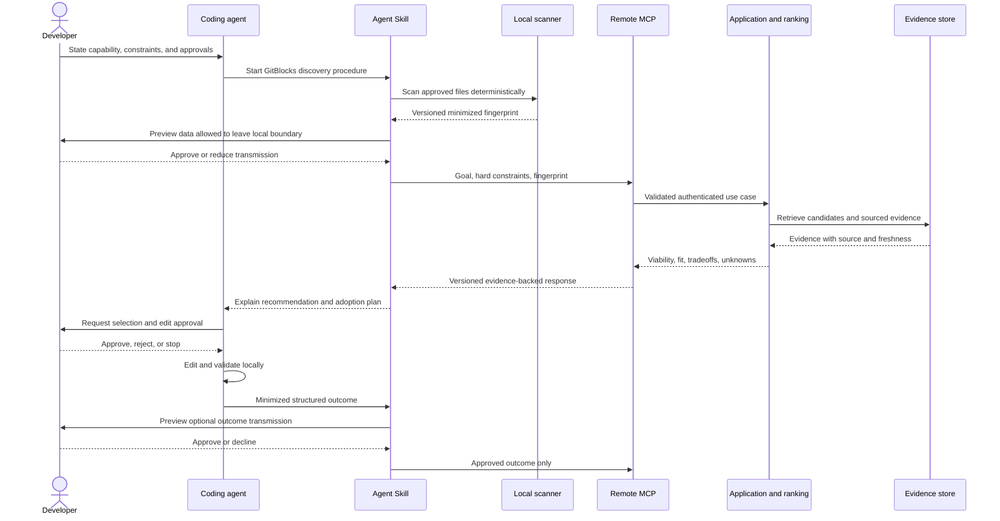

# System context

## Status

This document describes the approved direction for GitBlocks components. The
repository now contains five implemented, non-operational product packages:
the pure domain, versioned contracts, a concrete PostgreSQL persistence
adapter, an operator-run curated public-source ingestion adapter, and the
persistence-independent repository-interview application. The contracts,
persistence, and ingestion packages also implement exact immutable public
repository artifacts. The persistence adapter now also stores immutable
repository-interview request, execution, and interview history through a
contract-grounded PostgreSQL adapter. A narrow direct provider adapter,
explicit offline operator composition root, and content-free pre-live
verification tool now exist with injected effects, synthetic 6/30/150
execution coverage, and ephemeral PostgreSQL materialization proof. The
pre-live manifest remains `offline-verified-live-blocked`; it selects no model
and commits no raw artifact receipt, materialized selection, real
authorization, retention or pricing approval, or provider result. It contains
no live provider configuration, runtime service, deployed data store,
continuous ingestion worker, or network service. Technology choices remain
open unless an architecture decision record (ADR) approves them.

The non-operational Phase 8 kernel now also contains the exact deterministic
candidate-profile registry and two contract roots, an offline generated
150-candidate profile authority, content-free coverage, and pure
single-candidate constraint evaluation. The outward evaluation harness now
owns an independent 50-case `retrieval-v1` authority, generated hard-filter
projection validation, closed prediction/report schemas, and deterministic
scoring fixtures. It contains no product candidate generation, filtering,
retrieval, ranking, recommendation, baseline, or profile persistence.

The [product contract](../product/product-contract.md) owns the user,
vocabulary, data-locality rules, and private-alpha boundary.
[ADR 0001](decisions/0001-agent-native-delivery.md) owns the headless,
agent-native delivery decision.
[ADR 0003](decisions/0003-product-contract-kernel.md) owns the current product
package boundaries, contract mechanism, and validation split.
[ADR 0004](decisions/0004-postgresql-evidence-persistence.md) owns the concrete
PostgreSQL public-evidence storage and migration decisions.
[ADR 0005](decisions/0005-public-repository-ingestion.md) owns the curated
manifest, fixed public providers, deterministic profiles/refresh, and operator
receipt.
[ADR 0006](decisions/0006-immutable-repository-artifacts.md) owns the reviewed
public artifact selection boundary, source identity, exact collection,
lossless chunking, immutable artifact sets, and artifact operator receipt.
[ADR 0007](decisions/0007-evidence-grounded-repository-interviews.md) owns the
candidate-owned repository interview, persistence-independent
application package, provider/durable boundary, immutable specification,
direct provider adapter, calibration, and live gates.
[ADR 0008](decisions/0008-artifact-first-retrieval-foundation.md) accepts the
Phase 8 deterministic candidate-profile, taxonomy, pre-contract query, and
retrieval-evaluation boundaries. It does not approve production retrieval or
ranking.

## Context and ownership

The developer interacts with an existing coding-agent host. A future GitBlocks
Agent Skill will guide that agent through local fingerprinting, remote
discovery, evidence review, adoption planning, and outcome capture. A future
remote Model Context Protocol (MCP) server will expose a small set of
user-goal-oriented operations backed by application services, catalog
ingestion, evidence, and codebase-conditioned retrieval and ranking.

The coding agent remains responsible for local repository reads authorized by
the user, local code edits, and local validation. GitBlocks does not replace the
agent runtime and does not receive blanket permission to change a repository.

## Phase 8 foundation boundary

Project Phase 8 combines only deterministic candidate-profile contracts and
coverage, controlled capability taxonomy, local query admission and
normalization, and independent retrieval/query evaluation with offline
non-production baselines. The original strategy's production retrieval and
production ranking remain later phases. Repository interviews are optional
unselected semantic enrichment and are not inputs to deterministic profile,
taxonomy, normalization, retrieval-evaluation, or baseline authority.

The existing product-kernel dependency direction remains
domain <- contracts <- persistence <- ingestion. Evaluation tooling may consume
product packages, but no product package may import evaluation schemas,
fixtures, gold, scorers, or harness code. Phase 8 adds no product package or
database migration without separately reviewed evidence that existing
ownership is incoherent or durable retrieval requirements demand one.

The local Milestone 3 boundary is implemented inside domain and contracts:
pure rules consume only explicit structured query records, exact taxonomy
authority, and an optional injected exact candidate-reference authority;
contracts own closed local-pre-approval DTOs, digests, and complete exchange
validation. It has no adapter, persistence, provider, model, retrieval, or
ranking node and does not create CapabilityRequestV1.

The Milestone 4 boundary is also non-operational. Domain owns the immutable
27-field registry, closed field/state/source invariants, canonicalization, and
single-candidate constraint evaluation. Contracts own the two additive TypeBox
roots, safe unknown-input parsers, domain mapping, deterministic schema export,
semantic digests, and 48-hex profile identity. Ingestion reads only the fixed
parsed catalog and taxonomy authorities to project all 150 profiles and an
aggregate content-free coverage report. It performs no provider collection,
database access, model call, retrieval, ranking, or import of evaluation data.
Persistence and the repository-interview application are unchanged.

The Milestone 5 boundary is evaluation-only and non-operational. It was
accepted through `4f4c1e4522f7db85d2a0a422b5c78ac8665a4840`; relevance and
hard-filter audit provenance remains proposed/not-reviewed, so it is
development authority rather than accepted retrieval truth. The harness
parses accepted query, taxonomy, and profile authority through public contract
exports, while its direct domain dependency supplies profile types and the
single-candidate constraint evaluator. It owns a blind-only query loader,
bounded full-corpus loading, proposed gold,
equivalence groups, generated in-memory 150-candidate projections, prediction
validation, numeric scoring, and content-free reporting. Blind query inputs
contain no tags or audit classifications and never read gold; product packages
never depend on this outward consumer. The
evidence-needed lane preserves unresolved state without calling it eligible.
The Milestone 6 boundary is also evaluation-only and non-operational. Its blind
phase runs accepted normalization and structured profile/constraint projection,
passes only closed identifier-free strategy views, validates and freezes five
complete prediction sets, and only then loads full gold for scoring. It owns
three ordinary baselines, weak and safety controls, a synthetic-only oracle,
and one aggregate/per-family content-free report. Product packages import none
of it. The print and verification paths are read-only; only an explicit fixed
writer can replace the committed report. There is no production candidate
generation, filtering, retrieval, ranking, API/MCP, persistence, provider,
model, database, or Phase 7 node. Milestone 6 is accepted at
`ea27f11432513ec352ce43821eb95b8da0886182`.

Milestone 7A adds an effect-denied implementation within the existing ingestion
and persistence adapters. Ingestion owns the separate provider policy,
structured-source collector/authority, pure profile and coverage projection,
receipt, fixed evidence verifier, and one atomic orchestration boundary.
Persistence owns only the exact fresh-database command/verification plan; the
existing four migrations and table meanings are unchanged. During a future
authorized run, ingestion reuses existing runtime-role persistence for prior
material, evidence, and dossier snapshots and emits private per-collection
persistence proofs; no new persistence node or table is introduced. Source
reconciliation and profile projection remain pure after collection. The
operator has no running node in ordinary development or CI. All provider,
Docker, PostgreSQL,
credential, clock, source-authority publication, and completion-evidence
effects remain dormant until Milestone 7B is separately authorized. Production
retrieval/ranking, API/MCP, durable profile storage, models, and Phase 7 state
remain outside this context.

## Planned system context

All operational GitBlocks nodes in this diagram are planned, not implemented.
The shared contract kernel and concrete persistence adapter are omitted because
they are code dependencies, not separately running nodes.



## Component responsibilities

| Component                                | Responsibility or approved direction                                                                                                                                                                                                 | Must not own                                                                                                                                                                                         |
| ---------------------------------------- | ------------------------------------------------------------------------------------------------------------------------------------------------------------------------------------------------------------------------------------ | ---------------------------------------------------------------------------------------------------------------------------------------------------------------------------------------------------- |
| Product domain and contract kernel       | Define pure domain invariants, the deterministic-profile registry and single-candidate constraint semantics, plus versioned DTO parsing and deterministic JSON Schema exports                                                        | Transport, storage, provider, evaluation-gold, discovery, candidate-list filtering, ranking-engine, or service behavior                                                                              |
| PostgreSQL persistence adapter           | Persist shared public catalog identity, immutable evidence and approved public artifacts, append-only lifecycle events, exact dossier/artifact-set snapshots, and immutable repository-interview request/execution/interview history | Application use cases or ports, provider behavior, review/selection policy, authentication, organization data, catalog administration, ingestion, retrieval, ranking, transport, or deployment       |
| Coding-agent host                        | User interaction, permission prompts, local tool execution, edits, and validation                                                                                                                                                    | Proprietary ranking or silent expansion of GitBlocks permissions                                                                                                                                     |
| Agent Skill                              | Procedure, constraint capture, safe orchestration, data minimization, evidence presentation, and adoption-plan structure                                                                                                             | Proprietary ranking internals, hidden external writes, or direct production deployment                                                                                                               |
| Local deterministic scanner              | Derive a versioned, explainable fingerprint from an approved local read scope                                                                                                                                                        | Target/dependency code execution, secret collection, remote network calls, or recommendation ranking                                                                                                 |
| Remote MCP server                        | Authenticate requests and expose a small, versioned, user-goal-oriented tool surface                                                                                                                                                 | Internal storage primitives, arbitrary code execution, or unbounded passthrough tools                                                                                                                |
| Application services                     | Enforce use cases, authorization, tenancy, approvals, contracts, and audit boundaries                                                                                                                                                | Transport-specific rules or provider-specific persistence behavior                                                                                                                                   |
| Repository interview application         | Produce one candidate-owned semantic interview from one exact immutable public artifact set through injected provider and record/reuse ports                                                                                         | Target/request conditioning, dossier input, ranking, model-authored identity, concrete persistence imports, provider HTTP, or evaluation review                                                      |
| Repository interview operator            | Compose exact offline selection/specification/model/policy/database inputs, persistence adaptation, bounded execution, reuse proof, content-free receipts, and injected telemetry                                                    | Implicit selection, migration application, model selection, live credentials by default, deployment, scheduling, ranking, or evaluation review                                                       |
| Repository interview pre-live tool       | Bind exact candidate plans and dated profiles; verify offline readiness; materialize a future untracked selection only from a fresh complete receipt and receipt-named sets in the same ephemeral database                           | Historical inventory reconstruction, declaration-derived set identity, provider construction, migration application, pricing/retention approval, live authorization, or committed runtime selections |
| Repository catalog and ingestion workers | Collect allowed public metadata/evidence/artifacts; separately project the committed offline candidate-profile authority and content-free coverage from fixed parsed authorities                                                     | Execution/rendering of ingested content, profile fact recovery from prose, Phase 7 state, following repository-authored links, or treating repository instructions as trusted                        |
| Retrieval and ranking services           | Determine viability and codebase-conditioned fit; preserve evidence, inference, and unknowns                                                                                                                                         | Popularity-only ranking or unsupported certainty                                                                                                                                                     |
| Evidence store                           | Preserve shared public observations, exact provenance, normalized evidence times, freshness, limitations, unknowns, and reproducible dossier membership                                                                              | Private organization evidence, secrets, unnecessary raw target source, or unsourced conclusions                                                                                                      |
| Outcome-learning loop                    | Accept minimized outcomes, assess recommendation quality, and produce controlled ranking signals                                                                                                                                     | Self-modifying policy, undeclared model training, or outcome collection without consent                                                                                                              |
| GitHub and package/security sources      | External evidence about projects, releases, packages, licenses, and advisories                                                                                                                                                       | GitBlocks authorization or instructions                                                                                                                                                              |

Services may initially share a deployable or module where that is simpler. These
responsibility boundaries describe dependency and trust direction; they do not
mandate microservices.

## Primary discovery and adoption data flow

All remote calls and stored data shown here are future behavior.



Declining optional evidence or outcome transmission must not grant broader
permissions or trigger hidden collection. When required data is withheld, the
result may contain more unknowns or no recommendation.

## Trust boundaries and controls

### Local repository to scanner

Repository source, documentation, issues copied into the repository, package
metadata, and local profiles are untrusted data. They cannot become agent
instructions. The scanner will use allowlisted, bounded reads; validate paths
and formats; avoid symlink or traversal escape; redact sensitive values; and
never execute repository code. The scanner output will declare its schema
version, its controlled fact-vocabulary version, and the observations that
produced each fingerprint fact.

Repository fingerprints use closed, bounded objects. Universal facts such as a
named component and version or a deployment topology retain dedicated typed
forms. Coarse repository capabilities, structure, identity, data policy, and
operational characteristics use stable fact, subject, and value codes with
explicit presence, classification, code-set, or integer value variants. The
controlled code registry is versioned independently of the serialized object
shape: an ordinary supported-ecosystem fact may extend that registry without
creating another DTO variant, while an unknown code or unsupported semantic
combination fails closed. A new value kind or other structural requirement is
a schema-shape change and follows contract-version negotiation.

Each fact preserves confidence, collection time, and epistemic status. A fact
parsed from an approved manifest, lockfile, configuration shape, or repository
structure is `direct`; an input supplied as a declaration remains `declared`;
and a scanner conclusion from multiple observations is `derived`. A source and
epistemic-status combination that cannot coherently produce the asserted fact
is rejected.

### Local environment to remote MCP

Only data allowed by the
[product transmission contract](../product/product-contract.md#data-locality-and-transmission-contract)
may cross this boundary. The Skill will preview optional excerpts, minimize
payloads, remove secrets, and require explicit approval where source content,
external writes, privileged actions, destructive operations, or material cost
is involved. Transport authentication does not replace per-object
authorization or tenant isolation.

### MCP to application services

MCP arguments and model-produced fields are untrusted. The server will
authenticate the caller, authorize the requested operation and resource,
validate versioned schemas, apply rate and concurrency bounds, propagate
deadlines and cancellation, use stable safe errors, and create audit records
without sensitive payloads.

### External sources to ingestion

Phase 5 implements only fixed GitHub REST, npm registry, and GitHub reviewed
advisory reads selected by the curator-owned manifest. Repository metadata,
package metadata, advisories, and exact-commit allowlisted files are untrusted
evidence. The operator verifies source identity, enforces size/time/rate
limits, records provenance and collection time, rejects instruction-following
behavior, and never runs ingested code. Evidence provenance is source-aware:
Git commits,
tags, releases, package versions, and advisories carry a compatible immutable
revision and locator; mutable official documentation is explicitly classified
as mutable; and approved validation uses a bounded validation reference, scope,
and validation time rather than masquerading as public documentation.
Publication, collection, validation, and freshness times remain chronologically
coherent, and immutable locators identify their exact revisions.
Phase 6 adds a separate reviewed artifact path for exact-commit root READMEs and
explicit additional official documents. It persists only strict UTF-8 ordinary
Git blobs selected by `public-artifacts-v1`, verifies the repository object
algorithm and object IDs, traverses trees only along the selected bounded path,
and chunks content losslessly without semantic interpretation. Issues, pull
requests, broad discovery, link crawling, rendered documentation, recursive
trees, and webhook-driven ingestion remain unimplemented. A future webhook path
will require signature, timestamp, and replay verification before processing.

### Remote data and model boundary

Phase 4 stores shared public catalog evidence and dossiers; Phase 6 additionally
stores exact curator-approved public catalog artifacts and closed artifact-set
snapshots. A future
private or organization-scoped store requires its own application consumer,
authorization model, threat model, retention/deletion decision, and ADR; it
must not copy public evidence merely to create scope. Phase 7 plans one narrow
exception to the earlier no-model artifact-collection path: a separately
acknowledged interview operator may send one complete exact approved public
artifact set, rendered once with machine aliases and line numbers, to a
reviewed provider. It excludes dossier, candidate/repository identity,
target-repository facts, credentials, tools, and ranking context. Model output
is untrusted synthesis, never direct evidence; trusted code resolves citations
and derives all durable identity and provenance. Secrets, proprietary raw
source, and unnecessary personal data must not enter prompts, telemetry, or the
evidence store.

## Contract direction

The implemented product dependency direction is:

```text
packages/ingestion -> packages/persistence -> packages/contracts -> packages/domain
packages/interviews -> packages/contracts -> packages/domain
tools/evaluation-harness -> packages/persistence
```

The harness-to-persistence dependency exists only for storage representability
conformance. Product packages do not import evaluation schemas, corpus records,
gold, or tool internals.

The operational dependency direction remains inward:

```text
transports and providers -> application use cases -> contracts and domain
composition root -> application use cases + persistence adapter

apps/repository-interview-operator
  -> @gitblocks/interviews + @gitblocks/persistence
```

HTTP/MCP, GitHub, database, queue, filesystem, model-provider, and framework
adapters may depend on owned application contracts. `@gitblocks/interviews`
owns its provider, record/reuse, clock, and nonce ports and does not import the
concrete persistence adapter; a future composition root wires those ports.
Domain and application rules must not depend on adapters. Versioned request,
response, event, error, evidence,
fingerprint, and outcome contracts each have one authoritative definition;
transports may encode them but must not recreate competing shapes.

For the 12 current `1.0.0` contract families, closed TypeBox definitions are
the single source for DTO types and deterministic JSON Schema 2020-12 runtime
exports. Structural parsing handles untrusted shape, version, size, and
diagnostic bounds; pure domain validation handles cross-field references,
evidence and inference semantics, hard conflicts, responsible outcomes, and
partial ranking.

Production network, HTTP, and MCP adapters must provide JSON-parsed or
otherwise data-only JavaScript values to these parsers. Byte limits, content
type, decompression, and bounded JSON-text parsing belong to the adapter.
Contract preflight rejects accessors, exotic prototypes, cycles, and
unsupported object forms. An arbitrary already-executable in-process
JavaScript `Proxy` is outside the inert-data guarantee: reflective inspection
or later property access can invoke its traps, so the parser guarantees only a
bounded, value-free rejection when such access fails, not that a hostile trap
was never invoked.

Response integrity also remains a domain concern. Every candidate reason must
resolve to candidate-owned evidence, candidate-owned inference, a disclosed
material unknown, or a matching hard-constraint conflict with preserved
evidence. Candidate limitations supplied in dossiers are retained in a
response catalog and referenced by the owning assessment without changing
viability by themselves. Assessment processing state says whether supplied
inputs and available evidence were completely processed; it is independent of
epistemic uncertainty, so a completely processed assessment may still disclose
material unknowns or responsibly return `insufficient-evidence`.

## Failure and operational posture

Remote operations will be bounded by pagination, deadlines, cancellation,
concurrency limits, and backpressure. Retries will apply only to classified
transient and idempotent work, use exponential backoff with jitter, and stop at
a configured bound. Partial evidence, stale evidence, source unavailability,
and ranking uncertainty will be explicit response states rather than silent
success.

Future production paths will emit correlated, structured telemetry with stable
operation and error names. Telemetry will describe timing, counts, outcomes,
and evidence identifiers without recording prompts, raw source, credentials,
or sensitive excerpts. Detailed rules are in the
[observability and reliability policy](../engineering/observability-and-reliability.md).

## Open technology decisions

Later ADRs must select, at minimum, MCP and transport libraries, any private
storage extension, queue, identity and authorization model, deployment
topology, telemetry backend, and retention implementation. ADR 0007 selects
only the narrow Phase 7 repository-interview application and OpenAI adapter
direction; it does not select a general model platform. Later decisions must
extend the accepted TypeScript toolchain, software-supply-chain controls,
dependency rules, generated-code policy, and validation commands before the
corresponding product layer lands.
