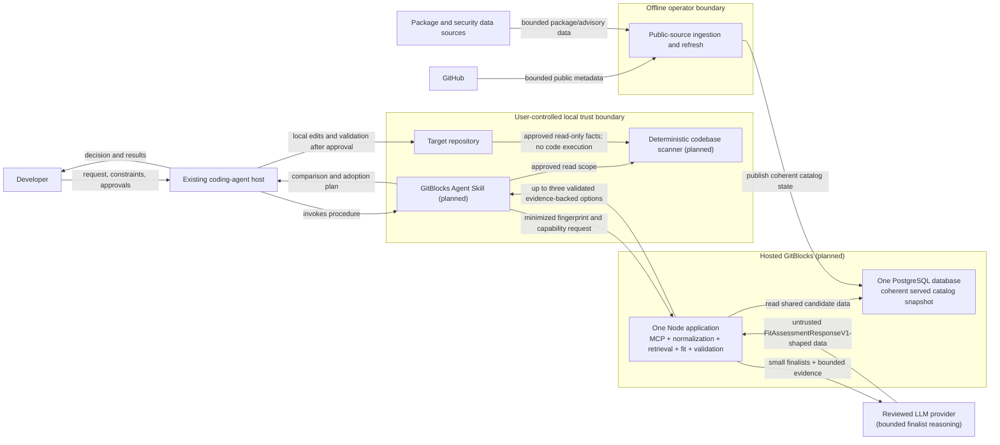
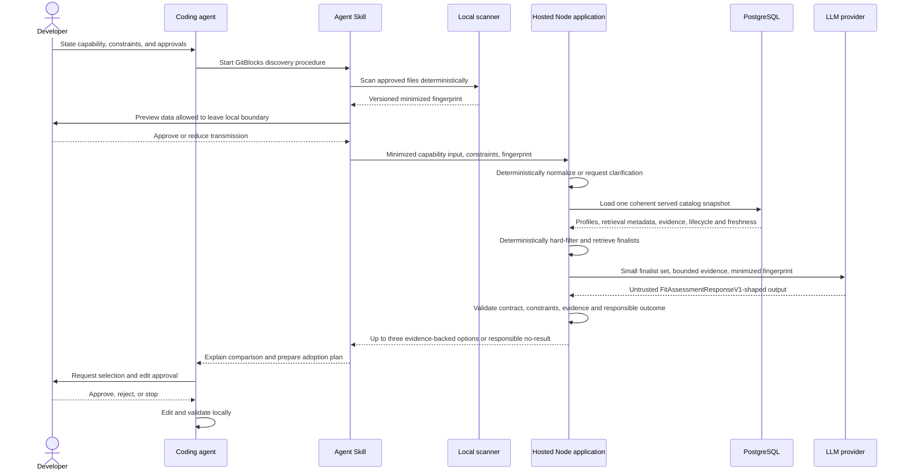

# System context

## Status

This document describes the approved hosted private-alpha direction and the
current lifecycle of GitBlocks components. Current main contains seven product
workspaces: the pure domain, versioned contracts, a concrete PostgreSQL
persistence adapter, an operator-run curated public-source ingestion adapter,
the persistence-independent repository-interview application, and the pure
`@gitblocks/retrieval` package, plus the hosted recommendation application and
loopback MCP transport. Retrieval is transport-neutral, in-process,
deterministic, bounded, evaluation-independent, and composed without owning
network, database, model, provider, transport, or deployment effects.

Recovery R3 implements the first executable hosted-architecture slice around
that pure engine: migration `0005`, immutable coherent serving snapshots, an
offline accepted-catalog bootstrap, a SELECT-only serving identity, and one
concrete contract-validating PostgreSQL loader. The complete
PostgreSQL-to-retrieval journey is executable.

Recovery R4 adds the first product-owned hosted application boundary without a
transport. Startup loads one current snapshot through the SELECT-only serving
identity, validates accepted static policy, constructs one immutable engine,
and exposes structured capability discovery in-process. A one-shot command
executes the same request twice without request-time PostgreSQL access and then
closes the client. No remote caller can use it yet.

Recovery R5 adds the first continuous Node process and a thin official MCP v2
adapter. The process initializes the R4 composition before listening, binds
only `127.0.0.1`, serves `/mcp`, and exposes exactly `discover_oss`. Modern MCP
`2026-07-28` requests and the SDK's default stateless legacy compatibility
share the same already-initialized application. Tool calls do not receive a
database client or reload serving state. Authenticated remote deployment
remains deferred.

Recovery R6 replaces generic discovery as the primary agent product with
exactly one `recommend_oss` tool. The same Node composition verifies a
request-scoped fingerprint binding, reuses the initialized retrieval engine,
selects no more than five eligible finalists, loads their active PostgreSQL
evidence at one trusted cutoff, calls one narrow OpenAI Responses target-fit
adapter, and validates the untrusted result through the existing fit exchange
plus repository-fact bindings. Evidence-needed candidates cannot be restored;
the successful responsible option set is at most three. The listener remains
loopback-only and unauthenticated, so remote deployment is still deferred.

Recovery R2 classifies the current implementation as follows without deleting
or moving anything:

- **Serving / active:** `packages/domain`, `packages/contracts`,
  `packages/retrieval`, PostgreSQL persistence needed by hosted serving,
  taxonomy/query normalization, deterministic candidate profiles, retrieval
  metadata, the implemented hosted recommendation composition, and its loopback MCP
  transport.
- **Offline active:** `packages/ingestion`, catalog/profile/metadata refresh,
  and explicit database migration/bootstrap operations.
- **Development support:** `tools/evaluation-harness` and
  `tools/repository-checks`.
- **Optional / dormant:** the Phase 6 artifact path until finalist evidence
  demonstrates a need, `packages/interviews`,
  `apps/repository-interview-operator`,
  `tools/repository-interview-prelive`, and the Phase 8 live materialization
  proof machinery.
- **Frozen R&D:** the Phase 10 branch and history. Issue #32 and PR #33 were
  superseded by Recovery R2 without merge; selective reuse is permitted only
  when real product dogfooding demonstrates the need.

The initial hosted product is planned as one Node application plus one
PostgreSQL database, with offline public-source ingestion publishing the shared
catalog state that the application serves. PostgreSQL is serving-required and
ingestion is offline-required. The pure retrieval engine is composed around
durable data; its purity does not make persistence optional. No Skill,
target-repository scanner, authenticated remote MCP service, deployed database,
local approval/integration path, or end-to-end private-alpha journey is
implemented on main yet. The durable accepted-catalog-to-validated-hosted-
recommendation sub-journey and loopback MCP interoperability path are now
implemented on main.

The evaluation harness owns immutable historical `retrieval-v1`, independently
reviewed governing `retrieval-v2`, projection validation, scoring fixtures, and
the blind adapter to product retrieval. It remains development support, not a
request-time application dependency. The interview and materialization proof
systems retain their legitimate historical and optional value without joining
the serving path.

The [product contract](../product/product-contract.md) owns the user,
vocabulary, data-locality rules, and private-alpha boundary.
[ADR 0001](decisions/0001-agent-native-delivery.md) owns the headless,
agent-native delivery decision.
[ADR 0003](decisions/0003-product-contract-kernel.md) owns the current product
package boundaries, contract mechanism, and validation split.
[ADR 0004](decisions/0004-postgresql-evidence-persistence.md) owns the concrete
PostgreSQL public-evidence storage and migration decisions.
[ADR 0005](decisions/0005-public-repository-ingestion.md) owns the curated
manifest, fixed public providers, deterministic profiles/refresh, and operator
receipt.
[ADR 0006](decisions/0006-immutable-repository-artifacts.md) owns the reviewed
public artifact selection boundary, source identity, exact collection,
lossless chunking, immutable artifact sets, and artifact operator receipt.
[ADR 0007](decisions/0007-evidence-grounded-repository-interviews.md) owns the
candidate-owned repository interview, persistence-independent
application package, provider/durable boundary, immutable specification,
direct provider adapter, calibration, and live gates.
[ADR 0008](decisions/0008-artifact-first-retrieval-foundation.md) accepts the
Phase 8 deterministic candidate-profile, taxonomy, pre-contract query, and
retrieval-evaluation boundaries. It does not approve production retrieval or
ranking.
[ADR 0009](decisions/0009-production-retrieval.md) accepts the implemented
Phase 9 pure retrieval package, transport-neutral contract, lane, provenance,
evaluation, and acceptance boundaries. It does not authorize Phase 10 ranking
or turn the pure package into an operational service.
[ADR 0011](decisions/0011-postgresql-retrieval-serving.md) owns the R3 serving
snapshot, offline publication, read-only role, loader, and forward-recovery
decisions; it does not own the R5 transport choice.
[ADR 0012](decisions/0012-openai-target-fit-provider.md) owns the initial
private-alpha target-fit provider, narrow model boundary, Structured Outputs,
privacy controls, and deterministic-validation authority.

## Context and ownership

The developer interacts with an existing coding-agent host. A future GitBlocks
Skill will guide that agent through bounded local fingerprinting, remote
recommendation, evidence review, adoption planning, and optional outcome
capture. The hosted Node application exposes one loopback MCP recommendation
tool backed by deterministic normalization/retrieval, PostgreSQL finalist
evidence, and bounded target-fit assessment. Offline
catalog ingestion is a separate operator action and never runs because a user
made a request.

The coding agent remains responsible for local repository reads authorized by
the user, local code edits, and local validation. GitBlocks does not replace the
agent runtime and does not receive blanket permission to change a repository.

## Phase 8 foundation boundary

Project Phase 8 combines only deterministic candidate-profile contracts and
coverage, controlled capability taxonomy, local query admission and
normalization, and independent retrieval/query evaluation with offline
non-production baselines. The original strategy's production retrieval and
production ranking remain later phases. Repository interviews are optional
unselected semantic enrichment and are not inputs to deterministic profile,
taxonomy, normalization, retrieval-evaluation, or baseline authority.

The existing product-kernel dependency direction remains
domain <- contracts <- persistence <- ingestion. Evaluation tooling may consume
product packages, but no product package may import evaluation schemas,
fixtures, gold, scorers, or harness code. Phase 8 adds no product package or
database migration without separately reviewed evidence that existing
ownership is incoherent or durable retrieval requirements demand one.

The local Milestone 3 boundary is implemented inside domain and contracts:
pure rules consume only explicit structured query records, exact taxonomy
authority, and an optional injected exact candidate-reference authority;
contracts own closed local-pre-approval DTOs, digests, and complete exchange
validation. It has no adapter, persistence, provider, model, retrieval, or
ranking node and does not create CapabilityRequestV1.

The Milestone 4 boundary is also non-operational. Domain owns the immutable
27-field registry, closed field/state/source invariants, canonicalization, and
single-candidate constraint evaluation. Contracts own the two additive TypeBox
roots, safe unknown-input parsers, domain mapping, deterministic schema export,
semantic digests, and 48-hex profile identity. Ingestion reads only the fixed
parsed catalog and taxonomy authorities to project all 150 profiles and an
aggregate content-free coverage report. It performs no provider collection,
database access, model call, retrieval, ranking, or import of evaluation data.
Persistence and the repository-interview application are unchanged.

The Milestone 5 boundary is evaluation-only and non-operational. It was
accepted through `4f4c1e4522f7db85d2a0a422b5c78ac8665a4840`; relevance and
hard-filter audit provenance remains proposed/not-reviewed, so it is
development authority rather than accepted retrieval truth. The harness
parses accepted query, taxonomy, and profile authority through public contract
exports, while its direct domain dependency supplies profile types and the
single-candidate constraint evaluator. It owns a blind-only query loader,
bounded full-corpus loading, proposed gold,
equivalence groups, generated in-memory 150-candidate projections, prediction
validation, numeric scoring, and content-free reporting. Blind query inputs
contain no tags or audit classifications and never read gold; product packages
never depend on this outward consumer. The
evidence-needed lane preserves unresolved state without calling it eligible.
The Milestone 6 boundary is also evaluation-only and non-operational. Its blind
phase runs accepted normalization and structured profile/constraint projection,
passes only closed identifier-free strategy views, validates and freezes five
complete prediction sets, and only then loads full gold for scoring. It owns
three ordinary baselines, weak and safety controls, a synthetic-only oracle,
and one aggregate/per-family content-free report. Product packages import none
of it. The print and verification paths are read-only; only an explicit fixed
writer can replace the committed report. There is no production candidate
generation, filtering, retrieval, ranking, API/MCP, persistence, provider,
model, database, or Phase 7 node. Milestone 6 is accepted at
`ea27f11432513ec352ce43821eb95b8da0886182`.

Milestone 7A adds an effect-denied implementation within the existing ingestion
and persistence adapters. Ingestion owns the separate provider policy,
structured-source collector/authority, pure profile and coverage projection,
receipt, fixed evidence verifier, and one atomic orchestration boundary.
Persistence owns only the exact fresh-database command/verification plan; the
existing four migrations and table meanings are unchanged. During a future
authorized run, ingestion reuses existing runtime-role persistence for prior
material, evidence, and dossier snapshots and emits private per-collection
persistence proofs; no new persistence node or table is introduced. Source
reconciliation and profile projection remain pure after collection. The
operator has no running node in ordinary development or CI. All provider,
Docker, PostgreSQL,
credential, clock, source-authority publication, and completion-evidence
effects remain dormant until Milestone 7B is separately authorized. Production
retrieval/ranking, API/MCP, durable profile storage, models, and Phase 7 state
remain outside this context.

## Planned system context

All GitBlocks runtime nodes in this diagram are planned, not implemented. The
diagram shows the smallest private-alpha deployment that another developer can
use. Internal module boundaries do not imply separate services.



## Component responsibilities

| Component                                                       | Responsibility or approved direction                                                                                                                                                                                                 | Must not own                                                                                                                                                                             |
| --------------------------------------------------------------- | ------------------------------------------------------------------------------------------------------------------------------------------------------------------------------------------------------------------------------------ | ---------------------------------------------------------------------------------------------------------------------------------------------------------------------------------------- |
| Product domain and contract kernel                              | Define pure domain invariants, deterministic query/profile/constraint semantics, versioned DTO parsing, and deterministic JSON Schema exports                                                                                        | Transport, storage, provider, evaluation-gold, or framework behavior                                                                                                                     |
| PostgreSQL persistence adapter                                  | Persist shared public candidate/evidence history plus immutable coherent profile/metadata serving snapshots; publish through the writer and reconstruct current or historical authorities through the concrete read-only loader      | Application use cases or ports, provider behavior, review policy, ingestion, retrieval, model reasoning, transport, implicit migration, or deployment                                    |
| Hosted PostgreSQL database                                      | Serve one coherent shared catalog snapshot containing the identity, deterministic profiles, retrieval metadata, evidence, limitations, unknowns, lifecycle, and freshness required by the active product path                        | Unnecessary target source, secrets, private organization data, evaluation gold, or model conclusions presented as evidence                                                               |
| Coding-agent host                                               | User interaction, permission prompts, approved local edits, installation, project validation, and debugging                                                                                                                          | Silent expansion of GitBlocks permissions or automatic candidate selection                                                                                                               |
| GitBlocks Skill                                                 | Capability/constraint capture, scanner orchestration, data preview and minimization, evidence-backed option presentation, and adoption-plan structure                                                                                | Proprietary ranking internals, hidden external writes, or direct production deployment                                                                                                   |
| Local deterministic scanner                                     | Derive a minimized, versioned, explainable `RepositoryFingerprintV1` from an approved local read scope                                                                                                                               | Target/dependency code execution, secret collection, remote network collection, or recommendation ranking                                                                                |
| One hosted Node application                                     | Compose MCP-facing operations, deterministic normalization, PostgreSQL snapshot loading, pure retrieval, bounded finalist evidence, LLM target-fit reasoning, deterministic response validation, and up to three responsible options | Request-time ingestion, migration, evaluation, artifact/interview/materialization operators, open-world model discovery, hard-constraint override, or enterprise control-plane machinery |
| Pure retrieval engine                                           | Deterministically retrieve and hard-filter candidate lanes from validated immutable authorities with exact provenance and identity deduplication                                                                                     | Database/network/provider/model effects, recommendation, target-fit reasoning, or evaluation policy                                                                                      |
| Bounded LLM target-fit adapter                                  | Reason semantically over only the minimized target fingerprint and small retrieved finalist/evidence set; return untrusted `FitAssessmentResponseV1`-shaped data                                                                     | Candidate discovery, provider collection, hard-constraint authority, evidence invention, local edits, or unvalidated user-facing output                                                  |
| Offline catalog ingestion and refresh                           | Collect bounded approved public metadata/evidence and publish coherent catalog/profile/metadata state into PostgreSQL through explicit operator actions                                                                              | Request-time execution, untrusted code execution/rendering, arbitrary crawling, or repository-authored instructions                                                                      |
| Repository interview, artifact, and materialization-proof paths | Retain optional/dormant evidence and historical proof capabilities until dogfooding establishes a current need                                                                                                                       | Default serving dependencies or authority to run because a user made a request                                                                                                           |
| Evaluation harness and repository checks                        | Provide development evidence, evaluation authority, and repository/process governance                                                                                                                                                | Product serving, recommendation authority, or runtime dependencies                                                                                                                       |
| GitHub and package/security sources                             | Provide untrusted public project, release, package, license, and advisory data                                                                                                                                                       | GitBlocks authorization, policy, or instructions                                                                                                                                         |

All request-time responsibilities initially live in one Node deployable. The
offline ingestion operation may reuse product adapters, but it does not execute
inside that request. These boundaries describe dependency and trust direction;
they do not mandate microservices.

## Primary discovery and adoption data flow

All remote calls and stored data shown here are future behavior.



Declining optional evidence or later outcome transmission must not grant
broader permissions or trigger hidden collection. When required data is
withheld, the result may contain more unknowns or no recommendation. Outcome
capture remains outside the minimum initial serving request.

## Trust boundaries and controls

### Local repository to scanner

Repository source, documentation, issues copied into the repository, package
metadata, and local profiles are untrusted data. They cannot become agent
instructions. The scanner will use allowlisted, bounded reads; validate paths
and formats; avoid symlink or traversal escape; redact sensitive values; and
never execute repository code. The scanner output will declare its schema
version, its controlled fact-vocabulary version, and the observations that
produced each fingerprint fact.

Repository fingerprints use closed, bounded objects. Universal facts such as a
named component and version or a deployment topology retain dedicated typed
forms. Coarse repository capabilities, structure, identity, data policy, and
operational characteristics use stable fact, subject, and value codes with
explicit presence, classification, code-set, or integer value variants. The
controlled code registry is versioned independently of the serialized object
shape: an ordinary supported-ecosystem fact may extend that registry without
creating another DTO variant, while an unknown code or unsupported semantic
combination fails closed. A new value kind or other structural requirement is
a schema-shape change and follows contract-version negotiation.

Each fact preserves confidence, collection time, and epistemic status. A fact
parsed from an approved manifest, lockfile, configuration shape, or repository
structure is `direct`; an input supplied as a declaration remains `declared`;
and a scanner conclusion from multiple observations is `derived`. A source and
epistemic-status combination that cannot coherently produce the asserted fact
is rejected.

### Local environment to remote MCP

Only data allowed by the
[product transmission contract](../product/product-contract.md#data-locality-and-transmission-contract)
may cross this boundary. The Skill will preview optional excerpts, minimize
payloads, remove secrets, and require explicit approval where source content,
external writes, privileged actions, destructive operations, or material cost
is involved. The initial hosted product needs only the access control required
by its concrete callers and shared public catalog; it does not pre-build an
organization or multi-tenant control plane. Transport authentication never
expands the approved data scope.

### MCP-facing transport to application composition

MCP arguments and model-produced fields are untrusted. The Node application
will validate versioned schemas, enforce the applicable caller and operation
boundary, apply bounded request behavior, propagate deadlines and cancellation,
use stable safe errors, and create only the telemetry/audit evidence justified
by the implemented path. Request handling cannot invoke ingestion, providers,
migrations, Docker, evaluation, artifact generation, repository interviews,
materialization proof, replay, or authority generation.

### External sources to ingestion

Phase 5 implements only fixed GitHub REST, npm registry, and GitHub reviewed
advisory reads selected by the curator-owned manifest. Repository metadata,
package metadata, advisories, and exact-commit allowlisted files are untrusted
evidence. The operator verifies source identity, enforces size/time/rate
limits, records provenance and collection time, rejects instruction-following
behavior, and never runs ingested code. Evidence provenance is source-aware:
Git commits,
tags, releases, package versions, and advisories carry a compatible immutable
revision and locator; mutable official documentation is explicitly classified
as mutable; and approved validation uses a bounded validation reference, scope,
and validation time rather than masquerading as public documentation.
Publication, collection, validation, and freshness times remain chronologically
coherent, and immutable locators identify their exact revisions.
Phase 6 adds a separate reviewed artifact path for exact-commit root READMEs and
explicit additional official documents. It persists only strict UTF-8 ordinary
Git blobs selected by `public-artifacts-v1`, verifies the repository object
algorithm and object IDs, traverses trees only along the selected bounded path,
and chunks content losslessly without semantic interpretation. Issues, pull
requests, broad discovery, link crawling, rendered documentation, recursive
trees, and webhook-driven ingestion remain unimplemented. A future webhook path
will require signature, timestamp, and replay verification before processing.

### Remote data and model boundary

Phase 4 stores shared public catalog evidence and dossiers; Phase 6 additionally
stores exact curator-approved public catalog artifacts and closed artifact-set
snapshots. A future
private or organization-scoped store requires its own application consumer,
authorization model, threat model, retention/deletion decision, and ADR; it
must not copy public evidence merely to create scope. Phase 7 plans one narrow
exception to the earlier no-model artifact-collection path: a separately
acknowledged interview operator may send one complete exact approved public
artifact set, rendered once with machine aliases and line numbers, to a
reviewed provider. It excludes dossier, candidate/repository identity,
target-repository facts, credentials, tools, and ranking context. Model output
is untrusted synthesis, never direct evidence; trusted code resolves citations
and derives all durable identity and provenance. Secrets, proprietary raw
source, and unnecessary personal data must not enter prompts, telemetry, or the
evidence store.

The active hosted-alpha model boundary is narrower and separate from repository
interviews. Only after deterministic hard filtering and retrieval may the
hosted application send a small finalist set, bounded attributable candidate
evidence, and the minimized target fingerprint to a reviewed LLM provider. The
model performs target-fit reasoning only. It cannot discover candidates,
collect evidence, restore excluded candidates, override hard constraints, or
write user-facing output directly. Its `FitAssessmentResponseV1`-shaped result
is untrusted until deterministic contract, constraint, evidence-reference, and
responsible-outcome validation succeeds. The Phase 7 interview model path
remains optional/dormant and is not a serving dependency.

## Contract direction

The implemented product dependency direction is:

```text
packages/ingestion -> packages/persistence -> packages/contracts -> packages/domain
packages/interviews -> packages/contracts -> packages/domain
tools/evaluation-harness -> packages/retrieval -> packages/contracts -> packages/domain
tools/evaluation-harness -> packages/persistence
apps/gitblocks-hosted -> packages/persistence + packages/retrieval + packages/contracts + packages/domain
```

The harness-to-persistence dependency exists only for storage representability
conformance. The harness-to-retrieval dependency is an outward blind evaluation
adapter. Product packages do not import evaluation schemas, corpus records,
gold, scorers, or tool internals. The hosted discovery composition and its
loopback-only MCP process are implemented; no authenticated remote service or
deployment is implemented.

The hosted dependency direction remains inward:

```text
MCP transport + PostgreSQL adapter + bounded LLM adapter
                         |
                         v
              hosted application use cases
                         |
                         v
            retrieval + contracts + domain

apps/repository-interview-operator
  -> @gitblocks/interviews + @gitblocks/persistence
```

The one Node composition root may depend on the hosted application use case,
`@gitblocks/retrieval`, and the concrete persistence/model/transport adapters.
The use-case module remains independent of persistence while its same-workspace
composition module owns the concrete startup client and target-fit adapter.
The MCP server closes over only the recommendation operation, and its native
Node listener reuses the one startup composition for every request. Offline ingestion composes
`@gitblocks/ingestion` with persistence separately and never joins a request.
`@gitblocks/interviews` retains its provider, record/reuse, clock, and nonce
ports without becoming an active hosted dependency. Versioned request,
response, event, error, evidence, fingerprint, and outcome contracts each have
one authoritative definition; transports may encode them but must not recreate
competing shapes.

For the 14 current `1.0.0` contract families, closed TypeBox definitions are
the single source for DTO types and deterministic JSON Schema 2020-12 runtime
exports. Structural parsing handles untrusted shape, version, size, and
diagnostic bounds; pure domain validation handles cross-field references,
evidence and inference semantics, hard conflicts, responsible outcomes, and
partial ranking.

Production network, HTTP, and MCP adapters must provide JSON-parsed or
otherwise data-only JavaScript values to these parsers. Byte limits, content
type, decompression, and bounded JSON-text parsing belong to the adapter.
Contract preflight rejects accessors, exotic prototypes, cycles, and
unsupported object forms. An arbitrary already-executable in-process
JavaScript `Proxy` is outside the inert-data guarantee: reflective inspection
or later property access can invoke its traps, so the parser guarantees only a
bounded, value-free rejection when such access fails, not that a hostile trap
was never invoked.

Response integrity also remains a domain concern. Every candidate reason must
resolve to candidate-owned evidence, candidate-owned inference, a disclosed
material unknown, or a matching hard-constraint conflict with preserved
evidence. Candidate limitations supplied in dossiers are retained in a
response catalog and referenced by the owning assessment without changing
viability by themselves. Assessment processing state says whether supplied
inputs and available evidence were completely processed; it is independent of
epistemic uncertainty, so a completely processed assessment may still disclose
material unknowns or responsibly return `insufficient-evidence`.

## Failure and operational posture

Remote operations will be bounded by pagination, deadlines, cancellation,
concurrency limits, and backpressure. Retries will apply only to classified
transient and idempotent work, use exponential backoff with jitter, and stop at
a configured bound. Partial evidence, stale evidence, source unavailability,
and ranking uncertainty will be explicit response states rather than silent
success.

R6 emits bounded structured recommendation lifecycle records and value-free
provider/application failures with stable operation
and error names. Future remote production telemetry will describe timing,
counts, outcomes,
and evidence identifiers without recording prompts, raw source, credentials,
or sensitive excerpts. Detailed rules are in the
[observability and reliability policy](../engineering/observability-and-reliability.md).

## Open technology decisions

R2 selects the smallest topology—one Node deployable and one PostgreSQL
database. R5 selects the official MCP TypeScript SDK v2 split server/Node
packages and native Node HTTP. R6 selects the initial OpenAI Responses
target-fit adapter without selecting an application framework, hosting
provider, or telemetry backend. A product implementation slice must select only the
technology it actually introduces and satisfy the accepted TypeScript,
supply-chain, dependency, contract, and validation policies. Queue, cache,
vector, microservice, Kubernetes, continuous-crawler, organization/tenant,
billing, and enterprise-governance decisions remain deferred unless a concrete
current blocker and observed evidence activate them. Ordinary slices do not
pre-design SLOs, dashboards, migrations, backpressure, or retention behavior
that they do not change.
