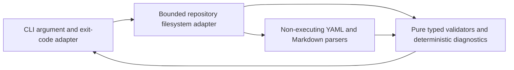

# Phase 1 TypeScript workspace and verification pipeline

## Status and authority

- Governing issue: [#3 — Phase 1: Establish the TypeScript workspace and verification pipeline](https://github.com/kgudipati/gitblocks/issues/3)
- Required branch: `build/3-typescript-toolchain`
- Owner: GitBlocks maintainers
- State: complete
- Last updated: 2026-07-28
- Authority order: Issue #3; the repository and Git history; the product
  contract and accepted ADRs; `AGENTS.md`, `PLANS.md`, and the engineering
  handbook; then implementation notes in this plan.

Issue #3 owns the deliverables, acceptance criteria, supported major release
lines, security constraints, and non-goals. This plan provides execution and
evidence traceability without weakening or restating that authority.

## Purpose and user-visible outcome

The current repository contains documentation and GitHub intake metadata but no
executable toolchain. This plan establishes an exactly pinned TypeScript
workspace and a deterministic repository-policy CLI so a contributor using a
supported Node 24 runtime can install with pnpm and run one local verification
command that GitHub Actions also runs.

The approved result is repository engineering infrastructure only: formatting,
typed linting, strict compilation, tests and coverage, dependency rules,
repository/documentation policy checks, secret scanning, dependency auditing,
CI, and Dependabot. Agent Skill, MCP, product services, application frameworks,
storage, queues, deployment, and product-domain behavior remain future work.

## Verified current repository state

Verification occurred on 2026-07-28 before the first edit.

- `git status --short --branch` initially reported clean
  `main...origin/main`; after `git fetch origin`, it correctly reported local
  `main` behind by two commits.
- `git remote -v` and `git remote show origin` identify
  `https://github.com/kgudipati/gitblocks.git`, with `main` as the default
  branch.
- `git fetch origin` advanced `origin/main` from `6801407` to `499d984`.
  `git pull --ff-only origin main` then fast-forwarded local `main`; no history
  was rewritten.
- `git rev-parse main` and `git rev-parse origin/main` were both
  `680140796096dd44b890a2790af0d7dc95d84ed9` before the fetch. After the fetch,
  local `main` was `6801407` and `origin/main` was
  `499d9847180c8f58549c4fe056f6a45843989693`; the fast-forward reconciled them.
- `git log --oneline --decorate --graph --all` confirms Phase 0 at `6801407`
  and preserves `265a6e0` (accidental empty `__nonexistent__` creation) followed
  immediately by `499d984` (deletion).
- `git rev-parse 6801407^{tree}` and `git rev-parse 499d984^{tree}` both
  returned `d88ae97d1b9e5b70c7e15b9ac1cb852cd99de9f`, proving no net tree change
  across the two auditable commits.
- `git ls-files` and `git ls-tree -r --name-only origin/main` showed only the
  Phase 0 documentation and repository metadata. No `package.json`, lockfile,
  production source, application package, CI workflow, or product scaffold
  existed.
- `git branch --all` showed no local or remote
  `build/3-typescript-toolchain`; the required branch was created from the
  fast-forwarded `main` and was clean before this plan.
- Issue #3 was read through the authenticated GitHub API because `gh` is not
  installed and the private issue returns 404 to unauthenticated clients. It is
  open, assigned to the maintainer, and has zero comments.
- Applicable repository sources were read before editing: the product contract,
  ADR 0001, system context, all engineering handbook documents, `PLANS.md`,
  `AGENTS.md`, `README.md`, `CONTRIBUTING.md`, `SECURITY.md`, and the PR
  template. There is no existing PR or issue-linked Phase 1 plan.

## Verified local runtime and package-manager state

The requested PATH checks produced:

```text
command -v node      -> unavailable
command -v npm       -> unavailable
command -v corepack  -> unavailable
command -v pnpm      -> Codex bundled fallback wrapper
node --version       -> command not found
npm --version        -> command not found
corepack --version   -> command not found
pnpm --version       -> 11.9.0
```

The Codex workspace dependency manifest exposed a bundled Node binary at
`/Users/karthikgudipati/.cache/codex-runtimes/codex-primary-runtime/dependencies/node/bin/node`.
Direct verification returned `v24.14.0`. macOS `codesign -dv --verbose=2`
verified a hardened-runtime signature from `Developer ID Application: Node.js
Foundation (HX7739G8FX)`. The bundled pnpm fallback is a shell wrapper that
executes this exact Node binary with the bundled pnpm module; it does not alter
the system installation or shell profile.

Node 24.14.0 satisfies the supported runtime boundary `>=24.12.0 <25`. The
repository will pin the latest researched LTS patch, Node 24.18.0, while its
engine range continues to support all Node 24 releases from 24.12.0. Commands
in this environment use the verified bundled paths explicitly. No Homebrew,
global package, shell-profile, or system runtime installation is planned.

## Scope and explicit non-goals

### In scope

- ADR 0002 and this maintained execution plan.
- Root pnpm workspace, exact runtime/tool pins, lockfile, strict TypeScript,
  ESLint, Prettier, Vitest/V8 coverage, dependency-cruiser, and Secretlint
  configuration.
- One private `@gitblocks/repository-checks` workspace package with bounded,
  deterministic branch, PR title, workflow, Markdown link, repository
  invariant, and CLI validation.
- Test-first unit, fixture, architecture, and CLI integration coverage.
- Supply-chain settings, complete dependency/license/install-script review,
  local audit scripts, CI, Dependabot, and contributor documentation.
- Ordinary commits, normal push, draft PR creation, and final CI inspection.

### Non-goals

Every Issue #3 non-goal remains prohibited. In particular, this change does not
add an Agent Skill, MCP server or SDK, API/backend/web application, database,
ORM, migration, queue, cache, object storage, Docker, GitHub App/webhook,
ingestion, catalog, fingerprint, retrieval, ranking, model call, authentication,
tenant/billing system, deployment, release automation, public package, CodeQL,
dependency-review action, repository ruleset, Turborepo, Nx, Bazel, Husky,
mandatory Git hooks, live-provider tests, or placeholder product directories.

## Exact official-version research

Research was performed on 2026-07-28 using primary project documentation,
official GitHub release/tag data, and npm registry metadata. Stable releases
were selected; prerelease, beta, RC, nightly, canary, preview, and floating tags
were rejected.

| Component                     | Durable policy                                             | Exact selected pin               | Primary evidence                                                                                                                                                                                              |
| ----------------------------- | ---------------------------------------------------------- | -------------------------------- | ------------------------------------------------------------------------------------------------------------------------------------------------------------------------------------------------------------- |
| Node.js                       | Node 24 LTS, minimum 24.12.0, exclude 25/26                | `24.18.0`                        | [Node release status](https://nodejs.org/en/about/previous-releases), [24.18.0 LTS release](https://nodejs.org/en/blog/release/v24.18.0), [native TypeScript support](https://nodejs.org/api/typescript.html) |
| TypeScript                    | Stable 6.0.x                                               | `6.0.3`                          | [TypeScript 6.0 notes](https://www.typescriptlang.org/docs/handbook/release-notes/typescript-6-0.html), npm registry                                                                                          |
| pnpm                          | Stable 11.x, exact `packageManager`                        | `11.17.0`                        | [installation](https://pnpm.io/installation), [settings](https://pnpm.io/settings), [supply-chain guidance](https://pnpm.io/supply-chain-security), npm registry                                              |
| ESLint                        | Current stable flat-config release compatible with Node 24 | `10.8.0`                         | [ESLint](https://eslint.org/docs/latest/use/configure/configuration-files), npm registry                                                                                                                      |
| `@eslint/js`                  | ESLint 10-compatible current stable package                | `10.0.1`                         | ESLint repository and npm peer metadata (`eslint: ^10.0.0`)                                                                                                                                                   |
| `typescript-eslint`           | Stable release supporting ESLint 10 and TypeScript 6.0     | `8.65.0`                         | [dependency support](https://typescript-eslint.io/users/dependency-versions/), [typed linting](https://typescript-eslint.io/getting-started/typed-linting/), npm registry                                     |
| `eslint-config-prettier`      | Disable conflicting stylistic lint rules                   | `10.1.8`                         | [project repository](https://github.com/prettier/eslint-config-prettier), npm registry                                                                                                                        |
| Prettier                      | Current stable 3.x                                         | `3.9.6`                          | [Prettier documentation](https://prettier.io/docs/), npm registry                                                                                                                                             |
| Vitest                        | Stable 4.x; reject Vitest 5 beta                           | `4.1.10`                         | [Vitest guide](https://vitest.dev/guide/), npm registry                                                                                                                                                       |
| V8 coverage                   | Match Vitest exactly                                       | `@vitest/coverage-v8@4.1.10`     | [Vitest coverage guide](https://vitest.dev/guide/coverage), npm peer metadata                                                                                                                                 |
| dependency-cruiser            | Current stable, Node 24-compatible                         | `18.1.0`                         | [rules reference](https://github.com/sverweij/dependency-cruiser/blob/main/doc/rules-reference.md), npm registry                                                                                              |
| Secretlint                    | Current stable, Node 24-compatible                         | `13.0.4`                         | [Secretlint documentation](https://github.com/secretlint/secretlint), [13.0.4 release](https://github.com/secretlint/secretlint/releases/tag/v13.0.4), npm registry                                           |
| Secretlint recommended preset | Match Secretlint exactly                                   | `13.0.4`                         | [recommended preset](https://github.com/secretlint/secretlint/tree/master/packages/%40secretlint/secretlint-rule-preset-recommend), npm registry                                                              |
| YAML parser                   | Current stable, safe non-executing YAML parser             | `yaml@2.9.0`                     | [yaml documentation](https://eemeli.org/yaml/), npm registry                                                                                                                                                  |
| Markdown parser               | Current stable CommonMark/mdast parser                     | `mdast-util-from-markdown@2.0.3` | [project repository](https://github.com/syntax-tree/mdast-util-from-markdown), npm registry                                                                                                                   |
| GitHub heading slugger        | GitHub-compatible duplicate heading slugs                  | `github-slugger@2.0.0`           | [project repository](https://github.com/Flet/github-slugger), npm registry                                                                                                                                    |
| Node type declarations        | Match supported Node major                                 | `@types/node@24.13.3`            | DefinitelyTyped/npm registry                                                                                                                                                                                  |

The direct packages above report Apache-2.0, MIT, or ISC licenses and official
project repositories. Their published manifests contain no `preinstall`,
`install`, or `postinstall` scripts. npm integrity metadata is present for
every selection; pnpm, typescript-eslint, Vitest, V8 coverage,
dependency-cruiser, and Secretlint publish npm attestations. The final review
must also cover the resolved transitive graph, licenses, prerelease absence,
source types, advisories, and lifecycle scripts after lockfile generation.

The final selected GitHub Actions are official project releases resolved to
immutable commit objects:

| Action               | Release  | Full commit SHA                            | Evidence                         |
| -------------------- | -------- | ------------------------------------------ | -------------------------------- |
| `actions/checkout`   | `v7.0.1` | `3d3c42e5aac5ba805825da76410c181273ba90b1` | Official release API and tag ref |
| `actions/setup-node` | `v7.0.0` | `820762786026740c76f36085b0efc47a31fe5020` | Official release API and tag ref |

`pnpm/action-setup@v6.0.9` was researched and initially pinned to
`0ebf47130e4866e96fce0953f49152a61190b271`. Hosted logs then showed its
self-installer reporting a high-severity npm advisory before switching pnpm
versions. Node 24 already ships Corepack, so the final workflow removes this
extra action and uses the exact integrity-bound `packageManager` pin with
`COREPACK_DEFAULT_TO_LATEST=0`.

GitHub's [workflow syntax](https://docs.github.com/en/actions/reference/workflows-and-actions/workflow-syntax)
and [security guidance](https://docs.github.com/en/code-security/tutorials/secure-your-organization/protect-against-threats)
support explicit least privilege and full-SHA action pins. Dependabot design
follows GitHub's [configuration reference](https://docs.github.com/en/code-security/concepts/supply-chain-security/about-the-dependabot-yml-file).

## Dependency inventory and review method

Planned root development dependencies are TypeScript, Node types, ESLint,
`@eslint/js`, typescript-eslint, `eslint-config-prettier`, Prettier, Vitest,
V8 coverage, dependency-cruiser, Secretlint, and the Secretlint recommended
preset. `tools/repository-checks` runtime dependencies are `yaml`,
`mdast-util-from-markdown`, and `github-slugger`; no argument, glob, filesystem,
or convenience framework is justified because Node provides the remaining
capabilities.

Review method:

1. Confirm exact manifest pins, engine/peer compatibility, official repository,
   license, maintainers, publication time, integrity, attestation/signature,
   direct dependency count, unpacked size, and lifecycle scripts using npm
   registry metadata.
2. Generate the lockfile only with pnpm 11.17.0 under the committed policy.
3. Run `pnpm licenses list --json`, enumerate unique resolved packages and
   licenses, reject non-permissive/unknown licenses, and record counts.
4. Inspect the lockfile for non-registry/exotic sources, prerelease versions,
   missing integrity, and unexpected optional/native packages.
5. Use pnpm build approval output and resolved manifests to identify every
   dependency with lifecycle scripts. Default-deny all; allow only a package and
   exact version whose build is required and reviewed. Record purpose, behavior,
   provenance, and risk for each true entry; record explicit false denials where
   they improve auditability.
6. Run the online pnpm audit and record advisories and registry failure
   behavior. No audit failure is suppressed.
7. Compare a second frozen install and complete tracked-worktree diff to prove
   reproducibility and no generated drift.

The generated lockfile contains 325 registry package records and 325 resolved
snapshots, each with SHA-512 integrity. It contains no prerelease or exotic
source and no `requiresBuild` entry. The current macOS installation exposes 295
package versions; the difference is primarily 27 platform-specific optional
Rolldown, Lightning CSS, and `fsevents` packages retained for cross-platform
resolution.

`pnpm licenses list --json` reports 295 installed package versions across MIT
(234), Apache-2.0 (17), ISC (12), BSD-2-Clause (9), BSD-3-Clause (8),
Artistic-2.0 (5), BlueOak-1.0.0 (2), MPL-2.0 (2), MIT-or-CC0 (2), and one each
of CC0-1.0, CC-BY-3.0, Python-2.0, and WTFPL. These are acceptable for
development tooling. The MPL packages are unmodified optional Lightning CSS
binaries and no dependency code or product artifact is distributed in this
phase. A bounded manifest review of all 295 installed package versions found
no `preinstall`, `install`, or `postinstall` script. The build allowlist
therefore remains empty, and no trust-policy exception is needed. The online
audit reports no known vulnerability.

## Requirements crosswalk

### Deliverables

| Issue #3 deliverable                        | Destination and milestone                                                    | Required evidence                                                                            |
| ------------------------------------------- | ---------------------------------------------------------------------------- | -------------------------------------------------------------------------------------------- |
| ADR 0002 with durable policy and exact pins | `docs/architecture/decisions/0002-typescript-workspace-and-toolchain.md`; M1 | ADR diff, links, version inventory, alternatives, consequences, measurable triggers          |
| Current execution plan                      | This file; M0-M6                                                             | Progress, decisions, failures, exact command evidence, final criterion reconciliation        |
| Runtime/root workspace files                | Root manifests/configuration; M1                                             | Exact pins, engine range, strict TypeScript checks, frozen install                           |
| pnpm workspace and supply-chain policy      | `pnpm-workspace.yaml`, manifests, lockfile; M1/M5                            | Config inspection, install behavior, lifecycle review, source/integrity scan                 |
| Real repository-checks package              | `tools/repository-checks`; M2-M3                                             | Buildable private package, narrow exports, CLI and unit/integration tests                    |
| TypeScript policy                           | Root and package tsconfigs; M1                                               | Compiler option review, `pnpm typecheck`, native-strip and emitted-output tests              |
| Lint and formatting                         | ESLint flat config, Prettier config/ignore; M1                               | Typed project service, zero-warning lint, check/write formatting commands                    |
| Vitest and V8 coverage                      | Vitest config and tests; M1-M3                                               | Deterministic tests, required cases, measured coverage baseline                              |
| Dependency boundaries                       | dependency-cruiser config and fixtures; M4                                   | Required rules, positive/negative fixture evidence, architecture command                     |
| Root command graph                          | Root/package scripts; M4                                                     | Every required command, deterministic offline `verify`, online `verify:ci`                   |
| GitHub Actions CI                           | `.github/workflows/ci.yml`; M5                                               | Self-validation, full pins/comments, read-only token, frozen install, clean tree, stable job |
| Dependabot                                  | `.github/dependabot.yml`; M5                                                 | npm and Actions weekly configuration, grouping, no automerge                                 |
| Documentation                               | README, AGENTS, CONTRIBUTING, activated handbook text; M5                    | Commands and status agree with ADR/configuration; Markdown links pass                        |
| Publication                                 | Intentional commits, normal push, draft PR; M6                               | Branch/commit list, exact title/body, final workflow run and job results                     |

### Acceptance criteria

| Acceptance criterion                                                              | Evidence owner                                                  |
| --------------------------------------------------------------------------------- | --------------------------------------------------------------- |
| ADR accepted in the PR with versions/rationale/consequences/alternatives/triggers | ADR 0002 and draft PR review state                              |
| Plan current with research, failures, corrections, exact evidence                 | This plan                                                       |
| Clean supported environment installs exact pnpm graph frozen                      | CI install plus two local frozen installs                       |
| Supply-chain controls active and permissions/exceptions documented                | pnpm config, install logs, ADR/plan review                      |
| Repository-checks cohesive, bounded, documented, type-safe, tested                | Package source, tests, lint/type/build/coverage                 |
| All required root commands exist                                                  | Root `package.json` and individual command results              |
| Offline deterministic `pnpm verify` passes                                        | Local and CI command evidence; audit excluded                   |
| `pnpm verify:ci` passes including audit                                           | Local online run and CI                                         |
| Coverage baseline recorded without arbitrary gate                                 | `pnpm test:coverage` output and plan evidence                   |
| CI immutable/read-only/no credentials/cache/secrets/prohibited trigger            | Repository-check workflow validator and manual YAML review      |
| CI passes final PR head and leaves tracked worktree unchanged                     | Workflow run/job and post-verify `git diff --exit-code`         |
| Dependabot monitors npm and Actions reviewably                                    | `.github/dependabot.yml`                                        |
| Documentation and enforcement agree                                               | Repository check, Markdown link test, final changed-line review |
| No product implementation introduced                                              | Tree/diff review and invariant check                            |
| Complete dependency/license/install/security review                               | Lockfile/license/lifecycle/audit evidence in ADR and plan       |
| No direct push/rebase/force-push after publication                                | Git history/remote publication log                              |
| Draft PR remains open and unmerged                                                | GitHub PR state                                                 |

## Assumptions, risks, and unresolved decisions

### Verified facts

- Node 24.14.0 is locally usable and supported; Node 24.18.0 is the latest
  researched Node 24 LTS patch.
- Exact stable releases exist for every approved tool major line.
- The repository contains no existing implementation to migrate.

### Verified implementation resolutions

- The exact graph resolves locally and in Linux CI under every committed pnpm
  control with no build or trust exception.
- All lockfile sources are registry/workspace sources with integrity, all
  installed licenses are compatible with development-only use, and the graph
  has no prerelease. Linux CI successfully resolved its applicable optional
  package selection.

### Risks and latest resolution milestone

| Risk or open decision                                      | Safe default and evidence needed                                                                                                                  | Resolve by |
| ---------------------------------------------------------- | ------------------------------------------------------------------------------------------------------------------------------------------------- | ---------- |
| Trust downgrade incompatibility in old transitive packages | Enable `no-downgrade`; use a bounded `trustPolicyIgnoreAfter` only with recorded age rationale, or exact package/version exclusions with evidence | M1         |
| Required lifecycle script                                  | Install fails closed; inspect exact package/version script and provenance before allowlisting                                                     | M1         |
| Markdown parser/slug edge mismatch                         | Use mdast plus `github-slugger`; fixture encoded, duplicate, malformed, and external cases                                                        | M3         |
| YAML aliases or deep structures exhaust resources          | Enforce file-byte and node/depth bounds before/after non-executable parsing; reject excess                                                        | M2         |
| Filesystem traversal or symlink escape                     | Realpath containment, tracked-file allowlist, sorted bounded traversal, negative tests                                                            | M2-M3      |
| CLI diagnostics leak repository content                    | Emit path/link/reason only, cap counts/lengths, never echo file bodies or secret matches                                                          | M2-M3      |
| Coverage baseline is initially unknown                     | Measure after required tests; do not invent threshold                                                                                             | M3         |
| Local Node differs from committed latest patch             | Local evidence uses supported 24.14.0; CI validates exact 24.18.0                                                                                 | M5         |

## Applicable ADRs and contracts

- The [product contract](../product/product-contract.md) changes only its
  current-status sentence from documentation-only to repository tooling; its
  product boundary and planned behavior remain unchanged. Repository checks
  are engineering tooling, not the planned local product scanner or
  product-domain implementation.
- [ADR 0001](../architecture/decisions/0001-agent-native-delivery.md) remains
  accepted and unchanged. Its non-execution and untrusted-content invariants
  apply to repository tooling.
- [System context](../architecture/system-context.md) remains future-facing.
  If updated, it will only distinguish implemented repository tooling from
  unimplemented product components.
- ADR 0002 will be created by this plan and will own the durable TypeScript
  workspace/toolchain decision. Exact current patches are replaceable pins under
  that policy, not eternal architecture.
- No public, persisted, API, MCP, event, job, evidence, fingerprint, or outcome
  contract is introduced.

## Architecture, data-flow, and performance impact

`@gitblocks/repository-checks` has pure validation modules and boundary
adapters. Business/product rules remain absent.



- The CLI parses fixed commands and explicit values; it does not construct
  shell commands from repository content.
- Repository root resolution walks parents to a bounded depth and requires
  expected repository markers. All scanned paths are relative, normalized, and
  contained by both lexical and realpath checks.
- Tracked workflow/Markdown candidates come from an injected or bounded
  filesystem adapter, are sorted, and are limited by file count, file bytes,
  aggregate bytes, parser depth/node count, diagnostic count, and path length.
- YAML is parsed as data with aliases disabled/limited and without executable
  schemas. Markdown is parsed into an mdast tree; no HTML rendering, module
  import, command execution, build, package install, or network request occurs.
- Runtime is proportional to bounded file bytes plus parsed nodes. The CLI is
  single-process and sequential in this phase for deterministic order and
  simple resource accounting; no retry, queue, concurrency, or backpressure
  behavior applies.
- Stable CLI exit codes will distinguish success, policy violation, usage
  error, and internal/tool failure. Diagnostics are deterministically sorted.

## Security, privacy, abuse, and supply-chain considerations

### Threat model

- Assets: repository integrity, local credentials/environment, CI token,
  contributor trust, deterministic validation evidence, and dependency
  integrity.
- Actors: trusted contributors/reviewers; untrusted pull-request authors;
  compromised packages/actions; malicious text, YAML, Markdown, paths, and
  symlinks in the repository.
- Entry points: CLI arguments, environment-provided branch/title values,
  workflow YAML, Markdown links/headings, filenames/symlinks, manifests,
  lockfile, dependencies, and GitHub event metadata.
- Primary abuse cases: instruction/prompt injection in repository text, command
  injection, dynamic import/execution, path or symlink escape, parser/resource
  exhaustion, secret leakage in diagnostics, mutable action tags, writable CI
  token, credential persistence, poisoned cache/lockfile, lifecycle script
  execution, exotic transitive sources, and freshly compromised releases.

### Controls

- Repository content is inert data. No scanned file is executed, built,
  imported, installed, evaluated, rendered as active content, or allowed to
  alter control flow outside defined parser results.
- No `eval`, `Function`, shell construction, dynamic import from scanned paths,
  unsafe YAML schema, executable Markdown processing, or live link request.
- Explicit path/size/depth/count/diagnostic bounds and deterministic ordering;
  containment and symlink negatives receive tests.
- Safe typed errors and concise diagnostics; no secret value or unrestricted
  file body is printed. Secretlint masks findings by default.
- Exact direct pins, committed lockfile/integrity, strict peers/engines,
  24-hour strict release age, missing-time failure, no-downgrade trust,
  untrusted lockfile verification, exotic subdependency blocking, and
  default-denied builds.
- CI uses only two reviewed full-SHA actions, `contents: read`, no secrets,
  no cache, no `pull_request_target`, no writable scope, checkout credential
  persistence disabled, bounded timeout, and cancellation.
- Tests use inert synthetic text, controlled temporary directories, no
  credentials, no global Git configuration, no network, and no arbitrary
  sleeps.

No personal/customer data, model/provider call, remote product transmission,
authentication, authorization, tenancy, retention, deletion, webhook, or
external product write is introduced. The ordinary branch push and PR creation
are explicitly authorized publication effects and occur only after local
validation.

Residual risk is limited to parser/tool defects, registry/action compromise
before discovery, and platform differences in path/symlink behavior. Exact
pins, delay/trust policy, negative tests, CI on Linux, and independent PR review
reduce but do not eliminate those risks.

## Implementation milestones

### M0 — verified state, research, and plan

- Complete repository, history, issue, runtime, policy, version, package, and
  action research.
- Create only this plan as the first repository edit.
- Evidence: commands and sources recorded above; clean required branch.

### M1 — ADR and exact workspace foundation

- Write ADR 0002 before final configuration.
- Add exact runtime/pnpm pins, root/private manifests, workspace globs without
  placeholder directories, strict NodeNext TypeScript configs, formatting,
  typed lint, Vitest, dependency-cruiser, and Secretlint configs.
- Generate the lockfile under strict supply-chain settings. Inspect failures
  before any allowlist/exception.
- Tests/config checks: compiler configuration smoke check, frozen install, peer
  and engine behavior, lifecycle policy, lock/source/license review.

### M2 — repository-checks skeleton and core policies, tests first

- Add private package with typed result/diagnostic/exit-code contracts,
  constants/bounds, pure branch and PR-title validators, bounded root/path/file
  adapters, and workflow policy parser.
- Add table-driven and fixture tests before or alongside each rule, including
  full action pins/comments, local actions, permissions, writable scopes,
  `pull_request_target`, credential persistence, depth/size bounds, symlinks,
  and inert malicious text.
- Evidence: focused Vitest runs, typecheck, lint, build.

### M3 — Markdown, invariants, CLI, and coverage

- Add Markdown file/fragment/duplicate/encoded/external handling and explicit
  repository invariants.
- Integrate commands without embedding rules in the CLI. Add temporary
  repository/subdirectory tests, deterministic diagnostics, stable exit codes,
  path negatives, and no-execution proof.
- Measure and record the V8 coverage baseline without a threshold.

### M4 — architecture and authoritative command graph

- Add dependency-cruiser rules and fixtures for cycles, unresolved/dependency
  declaration, production-to-test, dev-only imports, deep workspace imports,
  future layer direction, and product-to-tool prohibition without empty paths.
- Wire all required root scripts using pnpm recursive/filter primitives only.
- Prove local `verify` is deterministic/offline and `verify:ci` adds a visible
  online audit without duplicated tests/builds.

### M5 — CI, Dependabot, and documentation

- Add and self-validate `.github/workflows/ci.yml` using researched action
  commits and `.github/dependabot.yml`.
- Update README, AGENTS, CONTRIBUTING, and only handbook/system-context text
  whose enforcement is now real.
- Run two frozen installs and the complete required validation matrix; reconcile
  every issue criterion and record failures/corrections/results here.

### M6 — publication and CI reconciliation

- Self-review the complete diff and commit coherent Conventional Commit slices.
- Push `build/3-typescript-toolchain` normally; after this point never rebase,
  amend published commits, squash, or force-push.
- Open a draft PR titled exactly
  `build: establish TypeScript workspace and verification pipeline`, include
  `Closes #3`, keep the PR body/plan current, inspect the actual workflow run and
  jobs, and fix failures with ordinary follow-up commits.
- Stop with the draft PR open/unmerged and the latest CI result known.

## Testing and validation strategy

### Test-first sequence

1. Branch name tables: valid allowed types/issue/slug/length and invalid
   separators, case, dates, names, vague terms, lengths.
2. PR title tables: allowed types/scopes/breaking marker and invalid vague,
   malformed, uppercase-description, period, unsupported type, excessive size.
3. Workflow fixtures: pinned/commented external action, unpinned/short/missing
   comment, local action, permissions, writable permissions,
   `pull_request_target`, checkout credential persistence, oversized/deep YAML.
4. Markdown fixtures: valid relative file, fragments, duplicate headings,
   encoded fragments, missing file/fragment, malformed encoding, external URLs,
   anchors, images where applicable.
5. Repository invariants: foundation requirements, allowed workspace package,
   prohibited product/package artifacts, GitBlocks capitalization and allowed
   slugs.
6. CLI temporary repositories: root/subdirectory resolution, each command,
   stable exit codes/output order, bounds, symlink/traversal negatives, and
   malicious repository text that would create a marker if executed (assert
   marker remains absent).
7. dependency-cruiser positive and negative fixture graphs.

Unit and integration tests use Vitest temporary directories, explicit fixtures,
and injected inputs. They use no live network, arbitrary sleep, global Git
configuration, filesystem ordering, secret, or private implementation
assertion. Network tests, model evaluations, load tests, runtime telemetry
tests, database/provider integration, and end-to-end product tests are not
applicable because no such boundary exists. Parser size/depth/path abuse and
CLI filesystem integration are applicable and required.

### Exact commands and expected results

Working directory is the repository root. In this Codex environment, invoke the
verified bundled Node/pnpm paths explicitly; contributors and CI use the
committed runtime and package-manager pins.

```bash
pnpm install --frozen-lockfile
git status --short
pnpm format:check
pnpm lint
pnpm typecheck
pnpm build
pnpm test
pnpm test:coverage
pnpm architecture:check
pnpm repo:check
pnpm security:secrets
pnpm security:audit
pnpm verify
pnpm verify:ci
git diff --check
git status --short --branch
git diff --stat
git diff
```

All checks must exit 0. `security:audit` and `verify:ci` require the npm
registry and must fail visibly during registry outage. Tests and `verify`
require no credentials, provider, or nondeterministic network. Coverage must
report a measured baseline but has no percentage gate. The second frozen
install must leave the lockfile and tracked worktree unchanged.

Additional deterministic reviews:

- Compare all manifest specifiers to exact versions and `packageManager`.
- Enumerate licenses/resolved packages and inspect lifecycle scripts.
- Scan lockfile resolution types, integrity fields, prerelease identifiers, and
  exotic sources.
- Verify full 40-character CI pins and same-line release comments.
- Verify CI permissions, triggers, checkout settings, cache absence, timeout,
  concurrency, branch/title checks, stable job name, and clean-tree proof.
- Search for secrets/sensitive fixtures, arbitrary sleeps, network use in
  tests, prohibited scaffolds, unsafe eval/import/command patterns, comments,
  `FIXME`, and orphan `TODO`.
- Reconcile README, AGENTS, CONTRIBUTING, ADR, plan, configs, scripts, and every
  Issue #3 criterion.

## CI design

One workflow triggers on pull requests, pushes to `main`, and manual dispatch.
It declares `permissions: contents: read`, concurrency cancellation, one
bounded job with a stable human-readable required-check name, and no secrets or
cache. It checks out with `persist-credentials: false`, installs Node from
`.node-version`, installs the exact pnpm version, performs a frozen install,
proves tracked files are unchanged, validates pull-request branch/title values
only on PR events, and runs `pnpm verify:ci`. A final diff check proves
installation and verification did not change tracked files.

External actions use the full researched commit with a same-line release
comment. The repository workflow validator must pass against `ci.yml` before it
is committed. `pull_request_target`, writable permissions, floating action
refs, credential persistence, cache, secrets, suppressed audit failures, and
conditional verification skips are prohibited.

## Observability and operations

No path in this phase runs as a shared or production product service, worker,
request, webhook, MCP operation, deployment, or approval-gated product effect.
Production telemetry, traces, metrics, logs, audit events, SLOs, alerts,
health/readiness, and runbooks are therefore not applicable. The CLI is local
developer tooling and exposes stable exit codes plus bounded, safe diagnostics
as its operational interface. CI logs command failures without repository
bodies or secret values.

## Migration, compatibility, rollout, and recovery

There is no persisted, public API, MCP, event, job, database, deployment, or
product contract migration. This is the first executable workspace contract.

- Compatibility: Node `>=24.12.0 <25`, exact pnpm 11.17.0, ESM/NodeNext.
  Existing documentation-only contributors gain commands; no prior executable
  consumer breaks.
- Rollout: reviewable commits on the topic branch, draft PR, exact CI on the PR
  head, independent review, and later squash merge by a maintainer outside this
  task.
- Recovery before merge: revert individual coherent commits or close the draft
  PR. The root remains documentation-only on `main`.
- Recovery after a future merge: revert the squash commit to return to the
  Phase 0 tree; package-manager caches and ignored build output are disposable.
  Dependency pin updates use ordinary reviewed commits and regenerate, never
  hand-edit, the lockfile.
- No irreversible data step, mixed deployment, backfill, or destructive
  operation exists. Published topic history is immutable by policy and is
  corrected with follow-up commits.

## Exact exit criteria

- Every Issue #3 deliverable and acceptance criterion maps to passing evidence.
- ADR 0002, this plan, code, tests, configuration, lockfile, workflow,
  Dependabot, and documentation agree.
- All required commands pass; failures and corrections are retained below.
- Two frozen installs and final verification leave tracked files unchanged.
- Dependency, license, provenance, maintenance, transitive footprint,
  lifecycle, advisory, prerelease, source, integrity, and supply-chain reviews
  are complete with no undocumented exception.
- Required repository-check tests, bounds, negative/abuse cases, stable exit
  codes, deterministic ordering, and coverage baseline exist.
- No prohibited product service, dependency, scaffold, tool, secret, network
  test, arbitrary sleep, unsupported release, or mutable CI action exists.
- Changed-line, architecture, security, testing, operations, compatibility,
  documentation, and whitespace self-review is complete.
- Intentional commits are normally pushed only to the required topic branch; a
  draft PR with the exact title and `Closes #3` is open and unmerged; the latest
  CI head result and jobs are known.
- `main` contains only the authorized fast-forward from `origin/main`; Phase 1
  implementation never commits or pushes directly to `main`.

## Progress log

- [x] 2026-07-28 — M0 began: fetched remote state, read Issue #3 and repository
      policy, verified Phase 0/history/tree, fast-forwarded local `main`, and
      created the exact clean topic branch.
- [x] 2026-07-28 — Verified a supported, Node.js Foundation-signed local Node
      24.14.0 binary and safe bundled pnpm wrapper without installing system or
      global software.
- [x] 2026-07-28 — Researched stable direct tool/parser versions, compatibility,
      license/provenance/lifecycle metadata, pnpm controls, and immutable official
      action commits.
- [x] 2026-07-28 — Created this execution plan as the first repository edit.
- [x] 2026-07-28 — M1: accepted ADR 0002, exact manifests/configurations,
      strict pnpm policy, and generated lockfile.
- [x] 2026-07-28 — M2: implemented branch, PR-title, and bounded workflow
      policies test-first.
- [x] 2026-07-28 — M3: implemented Markdown, repository, filesystem, and CLI
      checks with 84 passing tests and the first V8 coverage baseline.
- [x] 2026-07-28 — M4: added dependency-cruiser rules with seven negative
      fixtures and wired the authoritative root command graph.
- [x] 2026-07-28 — M5: added self-validating read-only CI, Dependabot,
      activated documentation, completed two frozen installs, and passed the
      complete local validation matrix.
- [x] 2026-07-28 — M6: normally pushed the cache/bootstrap correction as
      `fb3cd0e6dd14515cad810b81e3835c6cf112debe`; hosted run `30343163983` /
      `Verification` passed, and full logs confirm cache disabled, exact
      integrity-bound Corepack bootstrap, read-only permissions, 87 tests, a
      clean audit, and clean-tree proofs.

## Decision and deviation log

- 2026-07-28 — Use Node 24.18.0 as the committed current pin while supporting
  `>=24.12.0 <25`. The local signed 24.14.0 runtime validates the minimum-major
  policy; hosted CI validated the exact current pin.
- 2026-07-28 — Use Node native type stripping for erasable repository-tool
  source execution and TypeScript emit for package output. `rewriteRelativeImportExtensions`,
  `erasableSyntaxOnly`, and explicit extensions keep both paths coherent.
- 2026-07-28 — Use `yaml`, mdast, and `github-slugger` rather than custom YAML
  or Markdown parsing. This adds reviewed transitive footprint but reduces
  parser ambiguity and supports required GitHub heading behavior.
- 2026-07-28 — Use only pnpm recursive/filter scripts. Task orchestrators and
  Git hooks remain rejected under Issue #3.
- 2026-07-28 — Keep `allowBuilds` empty. The strict install succeeded, the
  lockfile has no `requiresBuild` record, and all 295 installed package
  manifests lack install lifecycle scripts; no exception is justified.
- 2026-07-28 — Scope dependency-cruiser vendor diagnostics to owned modules
  while preserving direct dependency classification. It analyzes the external
  graph needed to identify `npm-dev` imports but does not apply unresolved or
  circular policy to third-party implementation internals.
- 2026-07-28 — Adopt Prettier formatting for the pre-existing Phase 0 text as
  part of activating a whole-repository `format:check`; this is mechanical
  baseline normalization, not a policy or product-scope change.
- 2026-07-28 — Because `gh` is unavailable, use the explicitly authorized
  authenticated GitHub API/connected GitHub app for issue/PR/CI operations and
  ordinary Git for fetch/branch/commit/push. No scope or publication rule
  changes.
- 2026-07-28 — Replace the initially selected pnpm setup action with Node 24's
  bundled Corepack after hosted logs showed that action's self-installer
  reporting a high-severity npm advisory. The exact `packageManager` version
  and digest remain authoritative, and `COREPACK_DEFAULT_TO_LATEST=0` prevents
  an unrelated latest-version lookup.

## Failed checks and corrections

- 2026-07-28 — `gh --version && gh auth status` failed with exit 127 because
  `gh` is not installed. Correction: used the authorized connected/authenticated
  GitHub path; no CLI installation was attempted.
- 2026-07-28 — Unauthenticated browser/API reads of private Issue #3 returned 404. Correction: used existing Git credential-helper authentication without
  printing or persisting credentials; the issue body and zero-comment state
  were read successfully.
- 2026-07-28 — PATH-based `node`, `npm`, and `corepack` checks failed. Correction:
  inspected the Codex workspace runtime, directly verified Node 24.14.0 and its
  Node.js Foundation signature, and inspected the pnpm wrapper. No unsupported
  runtime or automatic installation was used.
- 2026-07-28 — The first curl credential config attempted an unsupported
  `password` directive and exited 26 without making the request. Correction:
  passed the credential as curl's `user` config over stdin; no credential value
  appeared in command output.
- 2026-07-28 — The first exact-pnpm bootstrap failed because the pnpm wrapper's
  Node binary was not on `PATH`. Correction: invoked the reviewed wrapper with
  the signed bundled Node directory explicitly on `PATH`; pnpm 11.17.0 then
  ran successfully.
- 2026-07-28 — Test-first focused runs failed because the branch/title,
  workflow, Markdown, invariant, runner, CLI, and architecture modules or
  configuration did not yet exist. Correction: implemented each bounded rule
  slice, then reran the focused tests to green before integration.
- 2026-07-28 — The first `pnpm typecheck` found index-signature access errors
  under `noPropertyAccessFromIndexSignature`. Correction: used explicit indexed
  access at untrusted-object boundaries; the strict option remained enabled.
- 2026-07-28 — Initial dependency-cruiser fixture runs found an unsafe deep
  import regular expression, and the first owned-graph run reported unresolved
  imports inside Vitest internals. Correction: replaced the expression with a
  bounded package capture, proved it with a fixture, and scoped vendor
  diagnostics without suppressing owned-source failures.
- 2026-07-28 — The first whole-repository formatting check identified 28
  unformatted existing and new files. Correction: applied the committed
  Prettier policy; no file was excluded to manufacture a pass.
- 2026-07-28 — Initial typed ESLint execution applied type-aware TypeScript
  rules to JavaScript configuration and could not associate tests with a
  project. Correction: scoped TypeScript rules to TypeScript files and added
  explicit root/test projects. Subsequent semantic findings were corrected;
  no rule was disabled.
- 2026-07-28 — The first integrated Vitest run after making CI a required file
  failed because the temporary valid-repository fixture wrote an empty
  workflow. Correction: supplied a minimal read-only valid workflow fixture.
- 2026-07-28 — A new abuse test showed that a comment line preceding repeated
  identical `uses:` values could satisfy the release-comment check for every
  occurrence. Correction: ignored commented-out `uses:` text and associated
  each parsed occurrence with its corresponding source line; the final 84-test
  suite passes.
- 2026-07-28 — `shasum -a 256 pnpm-lock.yaml` failed before the first final
  frozen install because the host Perl could not activate the inherited
  `C.UTF-8` locale. Correction: used Git's deterministic `hash-object` as the
  non-mutating lockfile comparison; both installs retained
  `4afa910428e83e3494ed9abd25e79d1b8e94111e`.
- 2026-07-28 — A final verification invocation accidentally called the bundled
  pnpm 11.9.0 wrapper directly; engine enforcement rejected it before any
  script ran. Correction: retained strict enforcement and invoked the reviewed
  pnpm 11.17.0 bootstrap path used by the earlier validation matrix.
- 2026-07-28 — Hosted runs `30342397907` and `30342593960` reported success,
  but full log review exposed `actions/setup-node`'s default
  `package-manager-cache: true` input and the pnpm setup action's self-installer
  reporting one high-severity advisory. Correction: reopened M6, added failing
  regression cases for automatic/explicit/direct cache paths, explicitly
  disabled setup-node caching, and replaced the extra action with Corepack.
- 2026-07-28 — The first focused workflow cache-policy run failed its two new
  setup-node cases because no cache rule existed; the direct `actions/cache`
  case was added before implementation. Correction: added a focused validator
  for all three paths while preserving local-action handling.

## Validation evidence

Evidence below is current through initial publication and hosted CI.

| Command or review                                        | Date       | Observed result                                                                                                                                                                                              |
| -------------------------------------------------------- | ---------- | ------------------------------------------------------------------------------------------------------------------------------------------------------------------------------------------------------------ |
| `git status --short --branch`                            | 2026-07-28 | Clean initial `main`; clean required topic branch after creation                                                                                                                                             |
| `git remote -v`; `git remote show origin`                | 2026-07-28 | Correct GitHub remote/default branch; local `main` was fast-forwardable                                                                                                                                      |
| `git fetch origin`; `git pull --ff-only origin main`     | 2026-07-28 | Fetch found two commits; pull fast-forwarded without rewrite                                                                                                                                                 |
| `git log --oneline --decorate --graph --all`             | 2026-07-28 | Phase 0 and accidental create/delete commits preserved                                                                                                                                                       |
| Tree comparison at `6801407` and `499d984`               | 2026-07-28 | Identical tree `d88ae97...`; no net tree change                                                                                                                                                              |
| `git ls-files`; `git ls-tree -r --name-only origin/main` | 2026-07-28 | No package manifest, production code, CI, or product scaffold                                                                                                                                                |
| Issue #3 authenticated API read                          | 2026-07-28 | Complete open issue read; zero comments                                                                                                                                                                      |
| Requested runtime commands                               | 2026-07-28 | PATH lacks Node/npm/Corepack; bundled pnpm reports 11.9.0                                                                                                                                                    |
| Bundled Node direct version/signature                    | 2026-07-28 | `v24.14.0`; Node.js Foundation Developer ID signature verified                                                                                                                                               |
| npm registry metadata review                             | 2026-07-28 | Exact selected stable versions, compatible engines/peers, permissive direct licenses, integrity, no direct install lifecycle scripts                                                                         |
| Official action release/tag resolution                   | 2026-07-28 | Final checkout/setup-node releases resolved to full commit objects; researched pnpm action rejected after hosted bootstrap evidence                                                                          |
| Focused test-first Vitest runs                           | 2026-07-28 | Expected missing-module/config failures followed by passing branch/title, workflow, Markdown, invariant, CLI, and architecture slices                                                                        |
| `pnpm install --no-frozen-lockfile`                      | 2026-07-28 | Resolved 325 package records under all committed supply-chain controls; empty build allowlist                                                                                                                |
| Lockfile source/integrity/prerelease review              | 2026-07-28 | 325/325 integrity records; no exotic source, prerelease, or build-required record                                                                                                                            |
| Installed manifest lifecycle review                      | 2026-07-28 | 295 package versions reviewed; no preinstall/install/postinstall script                                                                                                                                      |
| `pnpm licenses list --json`                              | 2026-07-28 | 295 installed package versions; all licenses reviewed and compatible with development-only use                                                                                                               |
| `pnpm lint`; `pnpm typecheck`                            | 2026-07-28 | Pass after recorded configuration/type corrections                                                                                                                                                           |
| `pnpm test`                                              | 2026-07-28 | Final correction baseline: 8 files, 87 tests pass                                                                                                                                                            |
| `pnpm test:coverage`                                     | 2026-07-28 | 85.42% statements, 82.33% branches, 96.82% functions, 85.23% lines; no threshold                                                                                                                             |
| `pnpm architecture:check`                                | 2026-07-28 | Pass: 125 modules and 304 dependencies; seven negative fixtures also pass                                                                                                                                    |
| `pnpm build`; emitted CLI smoke                          | 2026-07-28 | TypeScript emit succeeds and built JavaScript validates the required branch                                                                                                                                  |
| Direct workflow-policy validation of `ci.yml`            | 2026-07-28 | Pass before staging/commit; immutable pins, comments, permissions, and checkout policy accepted                                                                                                              |
| `pnpm security:secrets`                                  | 2026-07-28 | Pass with masked-output defaults and minimal ignores                                                                                                                                                         |
| `pnpm security:audit`                                    | 2026-07-28 | Pass: no known vulnerabilities                                                                                                                                                                               |
| Two `pnpm install --frozen-lockfile` runs                | 2026-07-28 | Both pass in 159/157 ms; lock hash unchanged and no unstaged tracked diff                                                                                                                                    |
| `pnpm verify`                                            | 2026-07-28 | Pass without credentials, providers, network-backed tests, or duplicate test execution                                                                                                                       |
| `pnpm verify:ci`                                         | 2026-07-28 | Pass locally on the final 87-test correction, including the visible online audit                                                                                                                             |
| `git diff --check`; `git diff --cached --check`          | 2026-07-28 | Pass; no whitespace errors                                                                                                                                                                                   |
| Full local command matrix                                | 2026-07-28 | All required install, format, lint, type, build, test, coverage, architecture, repository, secret, audit, and verification commands pass                                                                     |
| Final acceptance/security/diff review                    | 2026-07-28 | Pass before publication: every criterion reconciled; semantic and formatted-baseline diffs reviewed; no product service, mutable action, secret fixture, unsupported source, or undocumented exception found |
| Focused hosted-log regression                            | 2026-07-28 | Two setup-node cache cases failed before implementation; final focused suite passes 18 cases including direct `actions/cache` rejection                                                                      |
| Corrected local `pnpm verify:ci`                         | 2026-07-28 | Pass with 87 tests, cache-free workflow policy, Corepack bootstrap configuration, and no known repository dependency vulnerability                                                                           |
| Initial implementation commit                            | 2026-07-28 | `f93b50e00682a133624f720561eba2b997e37ee6`; intentional Conventional Commit on the required topic branch                                                                                                     |
| Normal branch push and draft PR creation                 | 2026-07-28 | Branch published without force; draft PR #4 opened with the exact title and `Closes #3`, and remains unmerged                                                                                                |
| GitHub Actions runs `30342397907`, `30342593960`         | 2026-07-28 | Jobs passed, but full logs exposed an implicit setup-node cache input and pnpm action self-installer advisory; treated as a failed policy review and corrected rather than accepted                          |
| Corrected CI run `30343163983` / `Verification`          | 2026-07-28 | Pass on `fb3cd0e`: Node 24.18.0, pnpm 11.17.0 via Corepack, cache input false, read-only token, 325-entry supply-chain check, 87 tests, clean audit, and both worktree proofs confirmed in full logs         |
